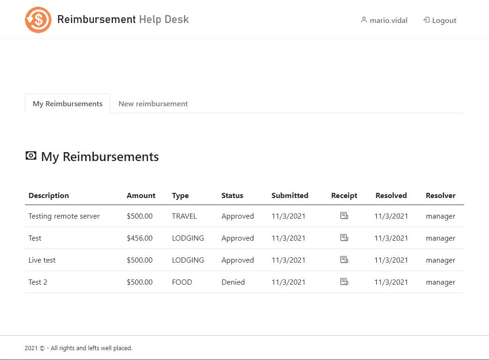

# Employee Reimbursement System (ERS)

## Project Description
The Expense Reimbursement System (ERS) will manage the process of reimbursing employees for expenses incurred while on company time. All employees in the company can login and submit requests for reimbursement and view their past tickets and pending requests. Finance managers can log in and view all reimbursement requests and past history for all employees in the company. Finance managers are authorized to approve and deny requests for expense reimbursement.

## Technologies Used

* HTML5
* JavaScript
* Bootstrap 5
* CSS3
* JQuery
* Java
* Javalin
* Log4J
* JUnit
* Hibernate
* AWS EC2
* AWS RDS
* PostgreSQL
* Jenkins
* GIT

## Features

* Login
  - User can login using username and password
  - Passwords are encrypted
  - Users can Logout and HTTP sessions are invalidated
* Employee homepage displays past reimbursement cases and their current status
* Employees can create a new reimbursement case
* Manager can also submit a reimbursement case
* Manager homepage has an extra option to approve/deny cases
* Employees can attach an image of the receipt to the case

## Getting Started
* Use git clone https://github.com/210927-JavaFS/project1-mcmarioman.git to clone project into your local machine
* Open project on STS 4
* Run project as a Java Application
* Database points to an AWS RDS PostgreSQL instance with public access.
* Front-End is stored on src/main/resources/static folder

## Usage
* On the browser, go to : http://localhost:4200/
* To login as an employee use credentials:
  - user: mario.vidal
  - password: password
* To login as a manager user credentials:
  - user: manager
  - password: admin
* Once logged in, use the tabs to switch options
* Homepage shows case history and their current status
* To add a new case go to New Reimbursement tab
* Login as a manager to approve/deny reimbursements
* Go to the Requests tab to see pending approval cases
* Clic on approve or deny button for each request and confirm. 

## Technical Requirements

The back-end system shall use Hibernate to connect to an AWS RDS Postgres database. The middle tier shall use Javalin technology for dynamic Web application development. The front-end view shall use HTML/JavaScript to make an application that can call server-side components RESTfully. Passwords shall be encrypted in Java and securely stored in the database. The middle tier shall follow proper layered architecture, have reasonable (~70%) test coverage of the service layer, and implement Logback for appropriate logging. 

## Contributors
mcmarioman (Mario Vidal)

## Screenshots

###### Login page

###### Employee page

###### New reimbursement form

###### Approving a reimbursement

